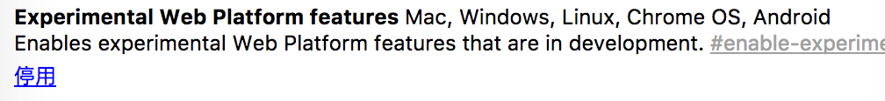
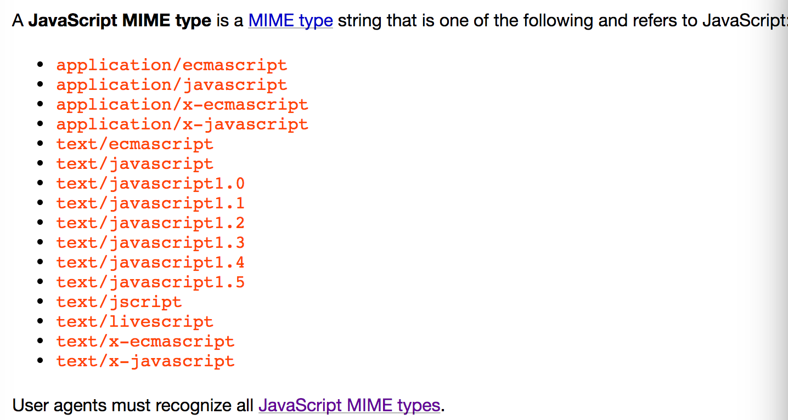

## ES模块化现身浏览器

---

支持的客户端:
* safari 10.1
* chrome Canary 60 - 在`chorme:flags`中开启`Experimental Platform flag`

* Firefox 54 在`about:config`中开启`dom.moduleScripts.enabled`

* Edge 15 – `setting in about:flags`中开启`Experimental JavaScript Features`

---

          

---
        // utils.js
        export function addTextToBody(text) {
          const div = document.createElement('div');
          div.textContent = text;
          document.body.appendChild(div);
        }

*在浏览器开启模块化需要在script标签的type属性设为module*

#### “赤裸裸”的import不支持

      // Supported:
      import {foo} from 'https://jakearchibald.com/utils/bar.js';
      import {foo} from '/utils/bar.js';
      import {foo} from './bar.js';
      import {foo} from '../bar.js';

      // Not supported:
      import {foo} from 'bar.js';
      import {foo} from 'utils/bar.js';

#### 模块标识符需要遵循如下规则:

1. 一个完整URL地址 例如http://google.com/123.js
2. 以 / 开始
3. 以 ./ 开始
4. 以 ../ 开始

其他标识符被保留为了将来使用,例如引进内建模块。

### 通过nomodule向后兼容

        
        

支持模块化的浏览器对于设置`nomodule`属性的script标签会忽略。这样对于支持模块化的浏览器使用模块树方式引用javascript文件而对不支持的浏览器可以通过原来方式引用。

* 火狐 Edge Safari 不支持nomodule

### 模块的script标签"默认开启defer"

        <!-- This script will execute after… -->
        

        <!-- …this script… -->
        

        <!-- …but before this script. -->
        

执行顺序是: 2.js 1.js 3.js

Script标签会阻塞HTML渲染,通常可以`defer`属性来避免这种阻塞,并且js会在文档渲染完成后执行.而执行顺序是以带有`defer`属性的script出现的顺序来执行.模块script标签表现如同设置`defer`属性的非模块script标签.

### 模块的内嵌script标签默认开启defer

        <!-- This script will execute after… -->
        

        <!-- …this script… -->
        

        <!-- …and this script… -->
        

        <!-- …but before this script. -->
        

执行顺序是: 1.js, inline script, inline module, 2.js

内嵌正常script忽略`defer`属性,而内嵌模块script默认开启`defer`无论标签内是否有引入其他js代码

### 异步执行外部/内嵌模块script

      <!-- This executes as soon as its imports have fetched -->
      

      <!-- This executes as soon as it & its imports have fetched -->
      

执行顺序是: 谁先下载完谁先执行

对于普通(对于模块script)script,`async`属性下载不会阻塞HTML渲染,但是下载完后会立即执行会阻塞HTML渲染,与普通script相反,内嵌模块script也会`async`

`async`不要出现DOM结构中.

* 火狐不支持`async`内嵌模块script

### 模块script只执行一次

        <!-- 1.js only executes once -->
        
        
        

        <!-- Whereas normal scripts execute multiple times -->
        
        

* Edge执行多次

### 跨域资源共享`CORS`

        <!-- This will not execute, as it fails a CORS check -->
        

        <!-- This will not execute, as one of its imports fails a CORS check -->
        

        <!-- This will execute as it passes CORS checks -->
        

与普通script不同,模块script可以跨域资源共享，但是必须获得有效CORS头部信息例如`Access-Control-Allow-Origin: *`.

### 无认证

        <!-- Fetched with credentials (cookies etc) -->
        

        <!-- Fetched without credentials -->
        

        <!-- Fetched with credentials -->
        

        <!-- Fetched without credentials -->
        

        <!-- Fetched with credentials-->
        

多数基于CORS的API在同源情况下会发送信任证书(例如cookies),但是`fetch()`和`module script`是例外.除非你要求发送不然默认是不发送的.

你可以通过添加crossorigin属性来给同源发送信任证书,如果给非同源发送可以用`crossorigin="use-credentials"`.同时注意到非同源会给你返回Access-Control-Allow-Credentials: true在http头部.

这也解释为何模块script多个相同URL只执行一次的原因.

### Mime-types

模块script于普通script不同，如果Mime-types类型如果不是有效的(如上图)将不会执行.

[原文地址](https://jakearchibald.com/2017/es-modules-in-browsers/)
